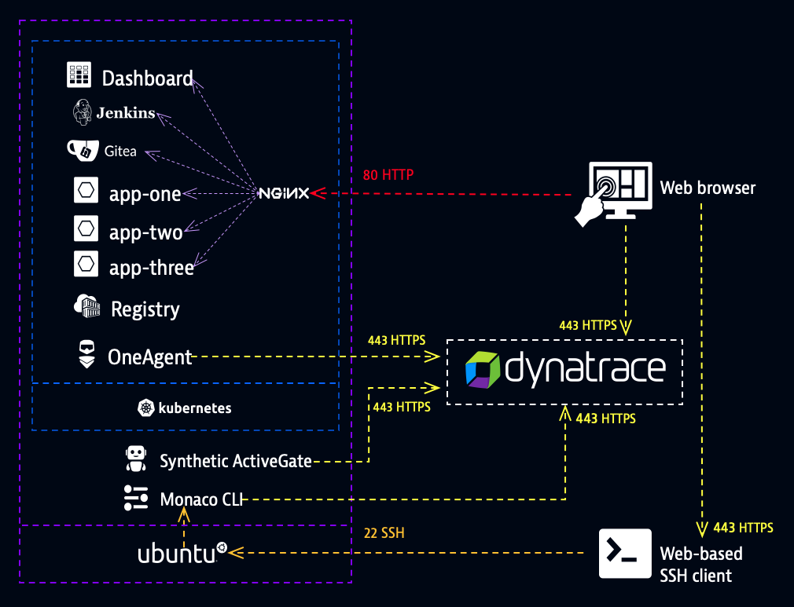
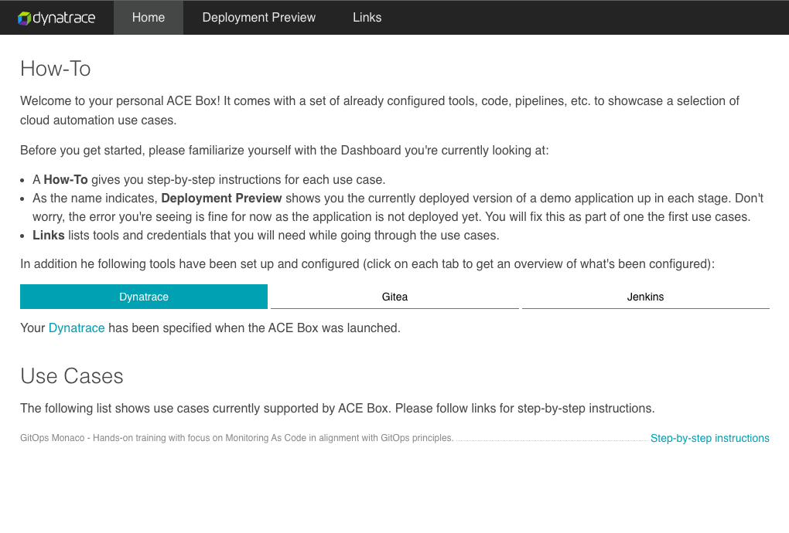

## Lab environment

### Overview

Each participant has a dedicated lab environment that includes:

* Dynatrace environment (a.k.a. Dynatrace tenant)
* Kubernetes cluster
  * Dashboard (links and app status)
  * Jenkins (automation server)
  * Gitea (Git server)
  * Applications (app-one, app-two, app-three)
  * Container registry
  * OneAgent (deployed by Dynatrace Operator)
  * Nginx (reverse proxy)
* Synthetic ActiveGate (private location)
* Monaco (command line interface tool)



### Connect

1. Log in on `Dynatrace University`
    <https://university.dynatrace.com>

2. On your university dashboard, you'll see an event named `GitOps for Observability and Security with Configuration as Code`. Go ahead and open up the event.

3. Select the `Environments` tab. Click on `Open terminal` to display an interactive shell at the bottom of the page. You can use this terminal for the remainder of the session.

    > **Note:** Dynatrace University provides a browser-based SSH client (recommended). If you prefer, you can use your own SSH client with the VM credentials shown on the `Environments` tab.

4. The terminal you opened will display a link to a dashboard. This dashboard is specific to you and contains all credentials and links for the tools you'll need in the following exercises.

    > **Note:** Your instructor will share _Basic Auth_ credentials needed to open the dashboard page.

    Open **Gitea** and **Jenkins** in new tabs and log in with their respective credentials shown on the dashboard.

    

    > **Note:** In addition to Dynatrace University, all lab instructions are hosted on Gitea. Monaco documentation can be found as part of the [official Dynatrace docs](https://www.dynatrace.com/support/help/setup-and-configuration/monitoring-as-code).

    > **Note:** You can retrieve the link to your dashboard at any point by running `echo "http://$(kubectl -n ace get ingress dashboard -o jsonpath='{.spec.rules[0].host}')/"`.

5. Execute the command below to ensure Monaco is properly installed on your VM.

    ```bash
    monaco
    ```

    The expected output for this command will be the Monaco help page that explains usage and command options.

    ```text
    Tool used to deploy dynatrace configurations via the cli

    Examples:
    Deploy configuration defined in a manifest
        monaco deploy service.yaml
    Deploy a specific environment within an manifest
        monaco deploy service.yaml -e dev

    Usage:
    monaco <command> [flags]
    monaco [command]

    Available Commands:
    completion  Generate the autocompletion script for the specified shell
    convert     Convert v1 monaco configuration into v2 format
    delete      Delete configurations defined in delete.yaml from the environments defined in the manifest
    deploy      Deploy configurations to Dynatrace environments
    download    Download configuration from Dynatrace
    help        Help about any command
    version     Prints out the version of the monaco cli

    Flags:
    -h, --help      help for monaco
    -v, --verbose   Enable debug logging

    Use "monaco [command] --help" for more information about a command.
    ```

6. From the `Environments` tab, use the `View environment` button to open up your Dynatrace environment in a new window and sign in with the provided credentials.

### We're now ready to kick off the lab!
