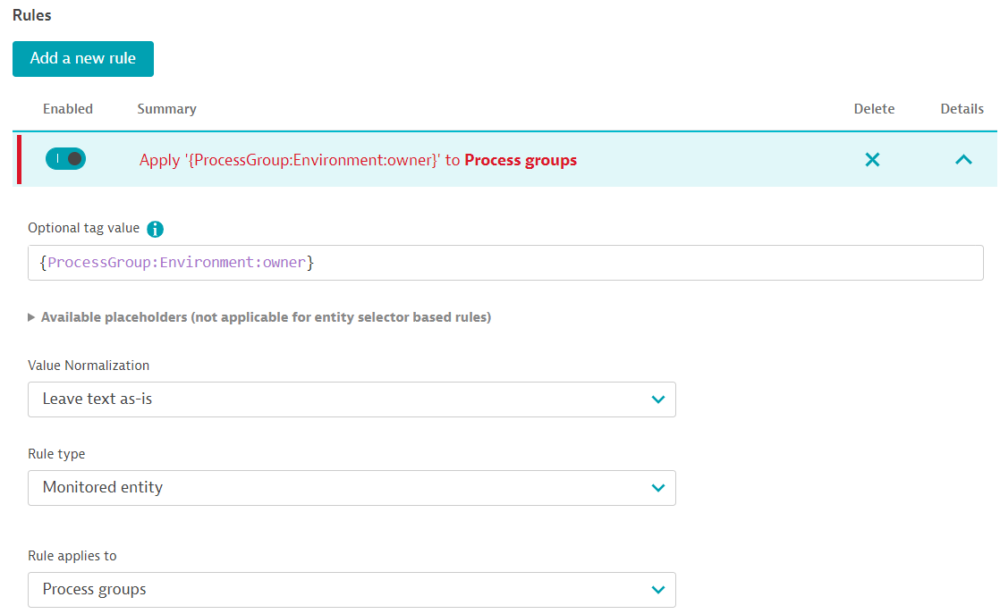
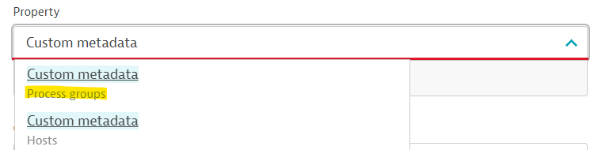
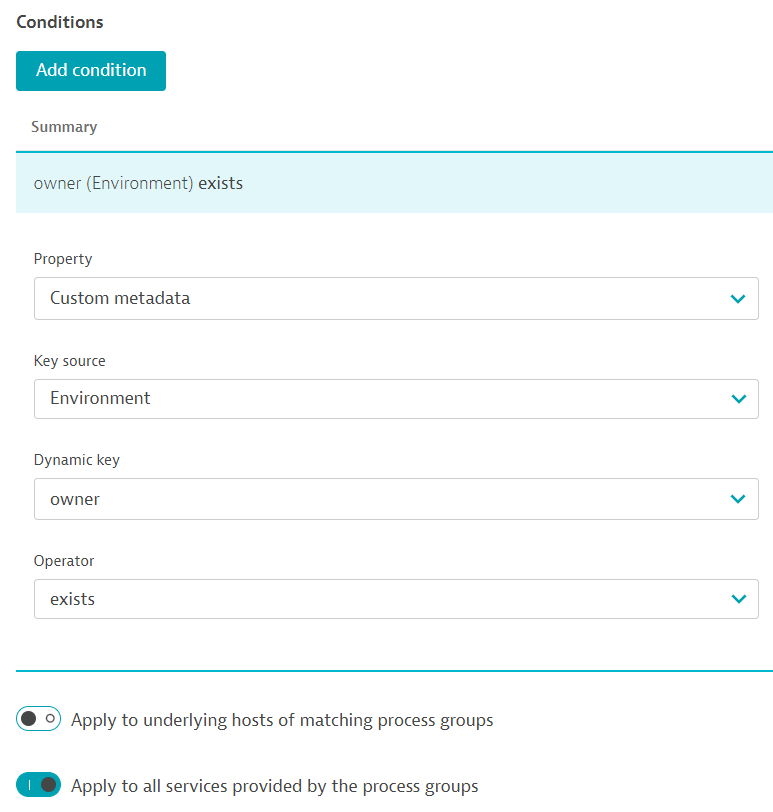
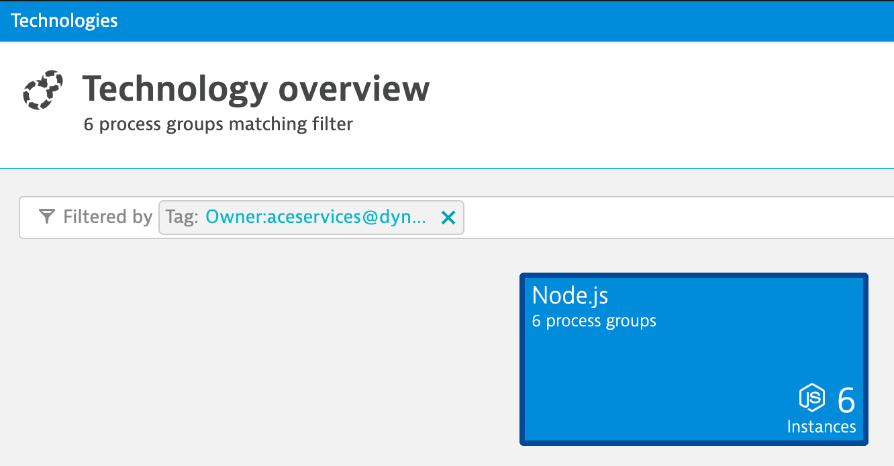
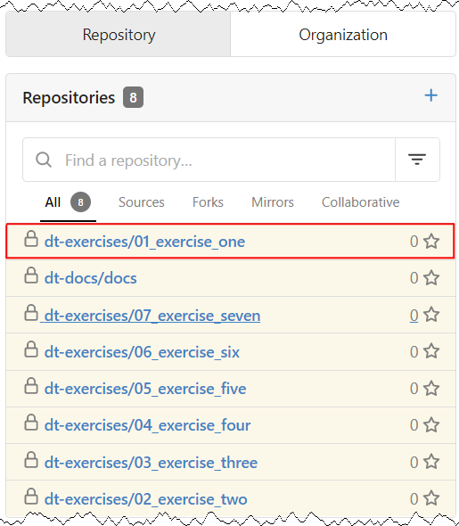
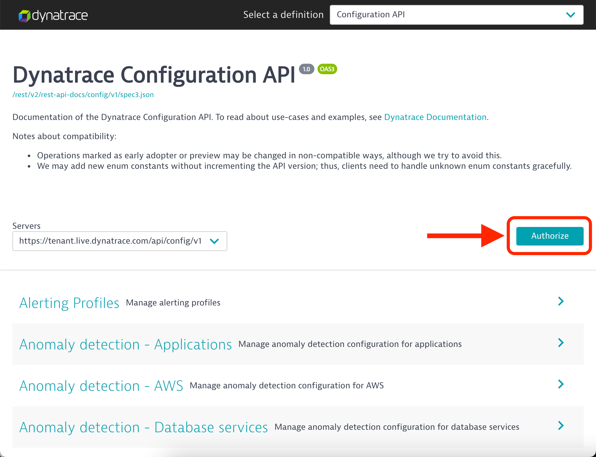
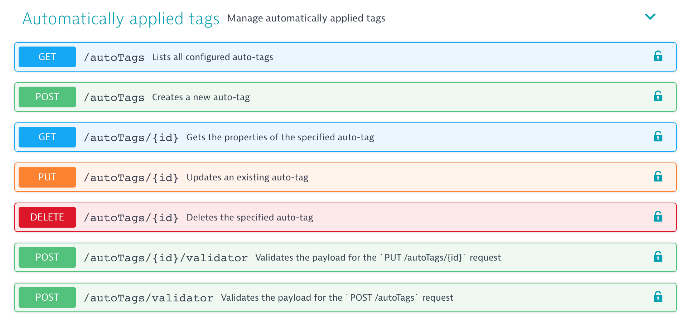
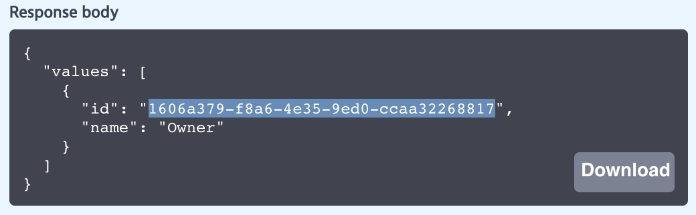
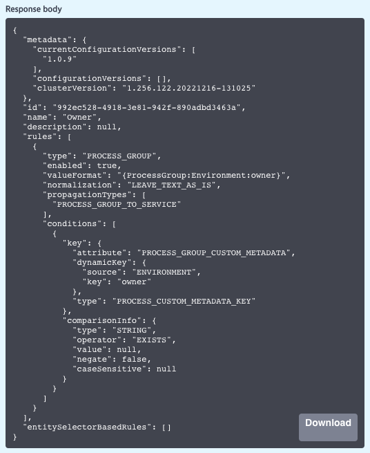
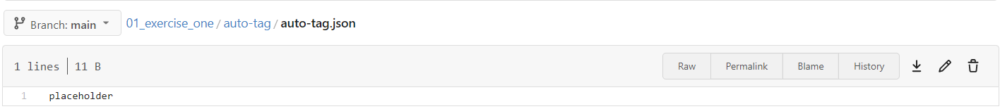

## Ex 1: Automatic tagging rule

This exercise will begin by creating an automatic tagging rule via the Dynatrace web UI. We'll then use the Dynatrace Configuration API to export the automatic tag configuration in JSON format. This exported configuration will then be used to build our Monaco project files. Finally, once our project structure is complete, we'll remove our automatic tag via the Dynatrace web UI and re-create it using Monaco!

### Step 1 - Create an automatic tagging rule in Dynatrace

First, we'll create an automatic *key:value* tag that identifies the owners of process groups. The value of this tag will be extracted from custom metadata already present on process groups.

1. Go to your Dynatrace environment and on the left navigation panel expand `Manage` and select `Settings`

2. Navigate to `Tags` > `Automatically applied tags`

3. Click on `Create tag`

4. Set `Tag name` to:
  
    ```text
    Owner
    ```

5. Click on `Add a new rule`

6. Set `Optional tag value` to:

    ```text
    {ProcessGroup:Environment:owner}
    ```

7. Set the following options

    * Value Normalization: `Leave text as-is`
    * Rule type: `Monitored entity`
    * Rule applies: `Process Groups`

    

8. Click on `Add condition`

9. Open up the `Property` drop-down menu and start typing `Custom metadata` to immediately jump to the desired option.
   Select the property for `Process groups`

   

10. Set the following options

    * Key source: `Environment`
    * Dynamic key: `owner`
    * Operator: `exists`

11. Check the box `Apply to all services provided by the process groups`

    

12. Click on `Preview`. You should already see a list of entities that are being monitored as part of the lab!

13. Click on `Save changes`

You can now filter **process groups** and **services** using the `Owner` tag!



### Step 2 - Define a manifest for Monaco

A Monitoring as code configuration is a complete set of project(s) and a deployment manifest.
Projects are directories (folders) used to logically group API configurations together.
Deployment manifests are files that tell Monitoring as code what projects to deploy and exactly where they should be deployed.

Manifests are YAML files with three top level keys `manifestVersion`, `projects` and `environmentGroups`. As of now, the supported `manifestVersion` is "1.0".

All entries under the `projects` top level key specify projects to deploy by Monaco. To specify the type of a project, one has to provide the `type` key in the project item. There are currently two types of projects:

* **simple**: Default type. All you need to provide is the `name` and `path` properties.
* **grouping**: Group multiple projects together, Monaco loads all sub-folders of a given path as simple projects

An environment definition consists of three parts:

* **name**: Must be unique
* **url**: Can be a value, or loaded from an environment variable
* **auth**: Specifies how to authenticate against the Dynatrace API. Authentication mechanism can be `token` or `oAuth`. Always define a `token` specifying the access token for general configuration and settings. To access a Dynatrace Platform environment, you also need to define an `oAuth` section specifying the oAuth client credentials (`clientId`, `clientSecret`). They will always load the the configuration from Environment Variables.

    >**Note:** Environments can be grouped together using `Environment Groups`, a mechanism allowing you to target specific environments together when deploying, or to overwrite configuration properties for several environments with one override rather than one per environment.

We'll now use Gitea to edit files in our repository.

1. Go to your Gitea instance and open the `dt-exercises/01_exercise_one` repository

    

2. Open and edit (click on pencil icon) the `manifest.yaml` file

3. Remove all contents in `manifest.yaml` and copy-paste the snippet below into it

    ```yaml
    ---
    manifestVersion: "1.0"

    projects:
      - name: auto-tag
        path: auto-tag
        type: simple

    environmentGroups:
      - name: development
        environments:
          - name: development-environment
            url:
              value: YOUR_TENANT_URL_GOES_HERE
            auth:
              token:
                name: DT_API_TOKEN
    
    ```

4. Update the url's `value` to your Dynatrace environment address. Include `https://` but ensure there is no trailing `/` at the end of the URL.

    > **Tip:** You can find your Dynatrace environment URL on your dashboard page.

    > **Note:** The YAML value `DT_API_TOKEN` refers to an environment variable with the same name that we'll set later.

5. Click on `Commit Changes`

Return to the `01_exercise_one` repsitory root folder. Here you'll find a folder called `auto-tag` with two files `auto-tag.json` and `auto-tag.yaml`.

Both files contain only placeholders for the moment. We'll need to update them.

* The JSON file is a template used for our API payload we plan to use to create an automatic tagging rule.

* The YAML file is used for the values we want to populate our JSON file with.

The YAML file can contain multiple configurations instances that can build different tag names and rules as Monaco will iterate through each instance and apply it to the JSON configuration template. In this exercise, we're simply deploying a single automatic tagging rule called `Owner`.

### Step 3 - Build a Monaco configuration template from the Dynatrace API

A great way to start building your Monaco project is by starting off from an existing Dynatrace configuration. Even if you're starting with a fresh Dynatrace environment, it may be worth creating a sample configuration in the web UI first. Then you can use the Dynatrace Configuration API to export the properties of the configuration in JSON for use in Monaco. From there, you can use your configuration YAML file to add additional configurations.

1. To use the Dynatrace Swagger UI, we need to get our API token which is stored in a Kubernetes Secret. On your VM, execute the command below to retrieve your Dynatrace API token.

    ```bash
    kubectl -n ace get secret monaco-dt-access-token -o jsonpath='{.data.apiToken}' | base64 -d
    ```

2. Paste your token into a notepad for later use

3. Open your Dynatrace environment, click on the profile icon on the top right and select `Configuration API`

4. Once in the Dynatrace Configuration API Swagger UI, click on `Authorize`

    

5. Paste your token into the value field and click on `Authorize` and then  `Close`

    >**Tip:** The token value is not checked when you click on `Authorize` so ensure you're pasting the correct value. If you make a mistake here, the next steps will fail with `401 Error: Unauthorized`

6. Now we need to get the ID of the tag `Owner` we manually created through the web UI earlier. Find and expand the `Automatically applied tags` endpoint.

    

7. Expand `GET /autoTags`

8. Click on `Try it out`

9. Click on `Execute`

10. Scroll down to the response body and copy the ID of the `Owner` tag

    

11. To get the actual configuration of the `Owner` tag expand `GET /autoTags/{id}`.

12. Click on `Try it out`

13. Paste the ID into the required `id` field

14. Set the boolean flag `includeProcessGroupReferences` to `true`

15. Click on `Execute`

16. Scroll down to the response body

    

    Copy the entire response body to your clipboard, including opening and closing curly brackets.

17. Go to Gitea and edit file `dt-exercises/01_exercise_one/auto-tag/auto-tag.json`

    

18. Remove the placeholder and paste the copied response body from the Dynatrace API output, but don't commit the changes just yet.

19. The first few lines contain identifiers of the existing configuration which cannot be included in the payload when creating a configuration. Therefore, we need to remove these lines starting with and including line `"metadata"` until and including line `"id"`.

    The desired file contents should now look like the snippet below:

    ```json
    {
      "name": "Owner",
      "description": null,
      "rules": [
        {
          "type": "PROCESS_GROUP",
          "enabled": true,
          "valueFormat": "{ProcessGroup:Environment:owner}",
          "normalization": "LEAVE_TEXT_AS_IS",
          "propagationTypes": [
            "PROCESS_GROUP_TO_SERVICE"
          ],
          "conditions": [
            {
              "key": {
                "attribute": "PROCESS_GROUP_CUSTOM_METADATA",
                "dynamicKey": {
                  "source": "ENVIRONMENT",
                  "key": "owner"
                },
                "type": "PROCESS_CUSTOM_METADATA_KEY"
              },
              "comparisonInfo": {
                "type": "STRING",
                "operator": "EXISTS",
                "value": null,
                "negate": false,
                "caseSensitive": null
              }
            }
          ]
        }
      ],
      "entitySelectorBasedRules": []
    }
    ```

20. Commit the changes

### Step 4 - Build the configuration YAML

1. Now let's edit file `dt-exercises/01_exercise_one/auto-tag/auto-tag.yaml`

2. Remove the placeholder and copy the contents below into the YAML file

    ```yaml
    configs:
      - id: auto-tag
        type: 
          api: auto-tag
        config:
          template: "auto-tag.json"
          name: "Owner"
    ```

    > **Note:** Monaco requires that the configuration YAML contains a `name` attribute (here the value is `Owner`). To keep things simple for now, the name attribute is hardcoded in this exercise. Monaco requires that the value of the `name` attribute is identical in both the YAML and JSON files. Therefore, it's recommended to parameterize the `name` attribute. We'll cover this in a later exercise.
    >
    > The config YAML tells Monaco where to find the configuration JSON template (here in the file `auto-tag.json`).

3. Commit the changes

### Step 5 - Delete the tagging rule in Dynatrace

Now that our project files are defined for a tagging rule, we'll manually delete the existing automatic tagging rule via the Dynatrace web UI so we can recreate it with Monaco.

1. Open the Dynatrace web UI and navigate to `Settings` > `Tags` > `Automatically applied tags`

2. Delete the tag called `Owner`

3. Save changes

### Step 6 - Pull latest changes to your local repo

We'll now pull the changes we made in Gitea to our local repo and execute Monaco to re-deploy the automatic tagging rule.

1. Open a terminal through your Dynatrace University event page to access your VM.

    > **Note:** Dynatrace University provides a browser-based SSH client (recommended). If you prefer, you can use your own SSH client with the VM credentials shown on the `Environments` tab.

2. Navigate into the `01_exercise_one` directory

    ```bash
    cd ~/01_exercise_one
    ```
  
3. Execute the following command to pull down all the changes we made in Gitea

    ```bash
    git pull
    ```

    > **Note:** In case you experience an issue with your git upstream, you can run the following command: `git pull --set-upstream gitea main`

4. Create a local environment variable called `DT_API_TOKEN` and populate it with the Dynatrace API token that's stored in a Kubernetes secret.

    ```bash
    export DT_API_TOKEN=$(kubectl -n ace get secret monaco-dt-access-token -o jsonpath='{.data.apiToken}' | base64 -d)
    ```

    Verify that the environment variable is created correctly

    ```bash
    echo $DT_API_TOKEN
    ```

    > **Note:** For this training, we use an environment variable to supply Monaco with our Dynatrace API token. For security reasons, this isn't a recommended approach for production environments. Consider storing APIs token safely, e.g. as a secret or in a credential vault.

    ***We're now ready to see Monaco in action!***

5. Execute Monaco with the dry run flag `--dry-run` which will validate our configuration without actually applying it to our Dynatrace environment.

    [Optional] The `-p` / `--project` flag can be used to target a specific project. By default, Monaco will deploy all projects.

    [Optional] The `-e` / `--environment` flag can be used to target a specific environment. By default, Monaco will deploy to all environments.

      ```bash
      monaco deploy --dry-run manifest.yaml
      ```

      Monaco should execute correctly without errors

      ```text
      2023/04/23 20:09:12 INFO  Projects to be deployed:
      2023/04/23 20:09:12 INFO    - auto-tag
      2023/04/23 20:09:12 INFO  Environments to deploy to:
      2023/04/23 20:09:12 INFO    - development-environment
      2023/04/23 20:09:12 INFO  Validating configurations for environment `development-environment`...
      2023/04/23 20:09:12 INFO        Deploying config auto-tag:auto-tag:auto-tag
      2023/04/23 20:09:12 WARN  API for "auto-tag" is deprecated! Please consider migrating to "builtin:tags.auto-tagging"!
      2023/04/23 20:09:12 INFO  Validation finished without errors
      ```

6. Remove the `--dry-run` flag to apply all configurations in the project

      ```bash
      monaco deploy manifest.yaml
      ```

7. Open your Dynatrace environment and verify that the `Owner` tag was recreated (refresh the page if it's already open)

      

### Congratulations on completing Exercise 1!
