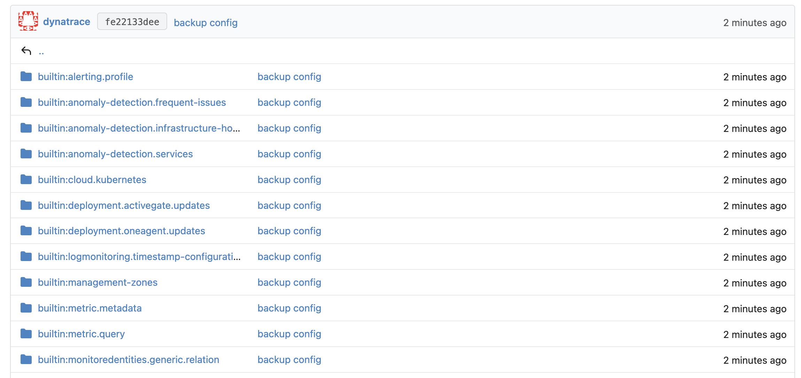

## Ex 3: Download all configuration

In this exercise, we'll see how Monaco can be used to download an existing environment's configuration. This is particularly handy when there are numerous existing custom configurations. You can download your configuration and push it into a repository, use it as a starting point for managed configuration changes, use it as a backup for your existing configuration or use it to migrate configurations from one environment to another.

### Step 1 - Explore different download options

First, let's take a look at the different options that Monaco provides to download configurations.

1. Open the SSH client that's connected to your VM and run the following command:

    ```bash
    monaco download --help
    ```

    The output lists various flags that can be used when downloading configurations directly.

    ```text
    Download configuration from Dynatrace

    Either downloading based on an existing manifest, or define an URL pointing to an environment to download configuration from.

    Usage:
    monaco download [flags]

    Examples:
    # download from  specific environment defined in manifest.yaml
    monaco download [--manifest manifest.yaml] --environment MY_ENV ...

    # download without manifest
    monaco download --url url --token DT_TOKEN [--oauth-client-id CLIENT_ID --oauth-client-secret CLIENT_SECRET] ...

    Flags:
    -a, --api strings                  One or more APIs to download (flag can be repeated or value defined as comma-separated list)
    -e, --environment string           Specify a concrete environment defined in the manifest file that shall be downloaded
    -f, --force                        Force overwrite any existing manifest.yaml, rather than creating an additional manifest_{timestamp}.yaml. Manifest download: additionally never append source environment name to project folder name
    -h, --help                         help for download
    -m, --manifest string              Name (and the path) to the manifest file. If not provided "manifest.yaml" value will be used. (default "manifest.yaml")
        --oauth-client-id string       OAuth client ID is used to connect to DT server via OAuth. Use only with "--url"
        --oauth-client-secret string   OAuth client secret is used to connect to DT server via OAuth. Use only with "--url"
        --only-apis                    Only download config APIs, skip downloading settings 2.0 objects
        --only-settings                Only download settings 2.0 objects, skip downloading config APIs
    -o, --output-folder string         Folder to write downloaded configs to
    -p, --project string               Project to create within the output-folder (default "project")
    -s, --settings-schema strings      One or more settings 2.0 schemas to download (flag can be repeated or value defined as comma-separated list)
        --token string                 Token secret to connect to DT server. Use only with "--url"
        --url string                   URL to the dynatrace environment from which to download configuration from. To be able to connect, token and, in case of connecting to platform, a pari of OAuth client ID na client secret needs to bi provide via adequate flags ("--token", "--oauth-client-id", "--oauth-client-secret"). Not able to combine with "--manifest".

    Global Flags:
    -v, --verbose   Enable debug logging
    ```

### Step 2 - Download environment configuration

1. Navigate into the directory of this exercise

    ```bash
    cd ~/03_exercise_three
    ```

2. You can use command flags to download an environment directly without using a manifest.
   To download from a Dynatrace Platform environment, you need to supply an API token as well as OAuth credentials:

    ```bash
    monaco download --url https://paltform-env.apps.dynatrace.com --token API_TOKEN_ENV_VAR --oauth-client-id CLIENT_ID_ENV_VAR --oauth-client-secret CLIENT_SECRET_ENV_VAR
    ```

    To download from earlier generations of Dynatrace, you only need to supply the API token:
    
    ```bash
    monaco download --url https://env.dynatrace.com --token API_TOKEN_ENV_VAR
    ```

    This command will get you started and create a manifest. After a direct download, you have everything you need to deploy your downloaded configuration.

    Get your Dynatrace URL from the DTU event or the dashboard. It should look similar to

    First, we need to retrieve your Dynatrace environment URL. Include `https://` but ensure there is no trailing `/` at the end of the URL.

    > **Tip:** You can find your Dynatrace environment URL on your dashboard page.

    Next, verify that the environment variable `DT_API_TOKEN` still exists

    ```bash
    echo $DT_API_TOKEN
    ```

    If not, recreate it from the Kubernetes secret

    ```bash
    export DT_API_TOKEN=$(kubectl -n ace get secret monaco-dt-access-token -o jsonpath='{.data.apiToken}' | base64 -d)
    ```

3. Let's now download the entire configuration using the following command, where `XXX` must be replaced by your Dynatrace environment URL noted earlier (without any trailing `/`):

    ```bash
    monaco download --url XXX --token DT_API_TOKEN --force --project backup --output-folder .
    ```

    Monaco will now download all the configuration of the monitoring environment in a newly created project folder named `backup` in the specified output directory.

    ```text
    2023/03/02 09:10:09 INFO  Downloading from environment 'https://XXX' into project 'backup'
    2023/03/02 09:10:09 WARN  API 'request-attributes' is deprecated by 'builtin:request-attributes' and will not be downloaded
    ...
    2023/03/02 09:10:09 INFO  APIs that won't be downloaded and need manual creation: 'azure-credentials, extension, credential-vault, aws-credentials'.
    ...
    2023/03/02 09:10:09 INFO  Resolving dependencies between configurations
    2023/03/02 09:10:09 INFO  Overwriting existing manifest.yaml in download target folder.
    2023/03/02 09:10:09 INFO  Downloaded configurations written to '.'
    2023/03/02 09:10:09 INFO  Finished download
    ```

    > **Note:** For the sake of this exercise we ignore any errors that point out a missing scope. In your real world environment you want to make sure that all required scopes are assigned.

### Step 3 - Store configuration in repository

1. Let's take a look at folder structure of the downloaded configuration.

    ```text
    ├── backup
    ...
    │    ├── builtin:management-zones
    │    │    ├── 9f3d6cde-112f-3cc6-8790-172ff9e84ef2.json
    │    │    ├── config.yaml
    │    │    └── ...
    │    ├── builtin:rum.web.app-detection
    │    │    ├── ...
    │    │    └── config.yaml
    ...
    │    └── synthetic-location
    │         ├── config.yaml
    │         └── SYNTHETIC_LOCATION-22D8C8858090B828.json
    └── manifest.yaml
    ```

    Notice that a manifest file was generated automatically by Monaco. This manifest file points to the Dynatrace Managed environment where the configuration was downloaded from.

2. We can now push this content back to our git repository:

   ```bash
   git add .
   git commit -m "backup config"
   git push
   ```

3. Go to Gitea and inspect the newly uploaded Dynatrace config in `dt-exercises/03_exercise_three/easyTravel`

   

### This concludes Exercise 3, GitOps is yet another step closer!
