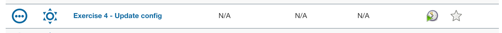
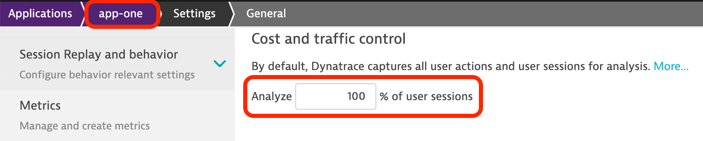
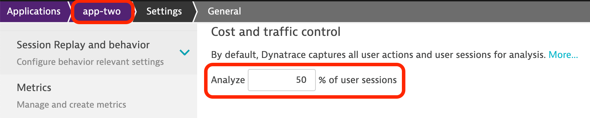

## Ex 4: Configuration variables
This exercise builds on top of exercise two—where we used a Jenkins pipeline and Monaco to manage our Dynatrace configuration.

Envision a scenario where you have similar application configurations, either in the same or in a different Dynatrace environment. You want to uniformly configure these applications so you use the same JSON template. How can you handle a requirement where one of the settings (e.g. user session coverage percentage) must be different across instances of this template?

The goal of this exercise is to introduce variables in our JSON templates to manage this requirement.

### Step 1 - Explore configuration

#### Folder structure

1. Using Gitea, explore the contents of the `dt-exercises/04_exercise_four` folder. It's the same structure as that of `dt-exercises/02_exercise_two` and looks like this:

    ```text
    ├── apps
    │    ├── app-one
    │    │    ├── _config.yaml
    │    │    └── auto-tag.json
    │    ├── app-two
    │    │    └── _config.yaml
    │    └── shared
    │         ├── _config.yaml
    │         ├── application-detection-rule.json
    │         ├── application.json
    │         ├── csm.json
    │         ├── dashboard.json
    │         ├── health-check-monitor.json
    │         ├── k8s-auto-tag.json
    │         └── management-zone.json
    ├── infrastructure
    │    ├── _config.yaml
    │    ├── auto-tag.json
    │    ├── private-synthetic.json
    │    └── request-attribute.json
    ├── manifest.yaml
    └── monaco.Jenkinsfile
    ```

#### Application configuration

2. In Gitea, navigate to the application definitions stored in `dt-exercises/04_exercise_four/apps/app-one/_config.yaml`

3. Take a closer look at the `application web` section

    ```yaml
    # application-web 
    - id: application-app-one
      type:
        api: application-web
      config:
        name: app-one
        template: ../shared/application.json
        skip: false
    ```

    We can see that this section makes use of a template stored in `../shared/application.json`. This template is also referenced from `dt-exercises/04_exercise_four/apps/app-two/_config.yaml`

### Step 2 - Introduce variables

In order to use variables in a Monaco configuration, we must replace hardcoded values in JSON objects with variables using the following format:

```text
{{ .VARIABLE_NAME }}
```

> **Note:** Although this format is based on the Golang template library and notations, only selecting a specific field is fully supported, i.e. dot followed by name of field.

In our example, we want to turn RUM coverage percentage, represented in the configuration template by the field `costControlUserSessionPercentage`, in a variable called `rumPercentage`.

1. To do so, in Gitea open the configuration template we identified earlier `dt-exercises/04_exercise_four/apps/shared/application.json`

2. On line 4, find the field `costControlUserSessionPercentage` and notice that the value is hardcoded as `10`:

    ```json
    "costControlUserSessionPercentage": 10,
    ```

3. Turn the value of that field `10` into a variable:

    ```json
    "costControlUserSessionPercentage": "{{ .rumPercentage }}",
    ```

    > **Note:** Even though the variable placeholder doesn't represent a string value, it must still be surrounded with double quotes `"`
    >
    >The dot `.` in front of `rumPercentage` is also required as it's part of the format.

4. Commit the changes

### Step 3 - Reference value and assign a value

Now that we have defined a variable in the JSON template, we can assign values to it in the YAML file that contains the instances of the template to be created.

1. In Gitea, open the `dt-exercises/04_exercise_four/apps/app-one/_config.yaml` file, add the variable, and assign a value to it like shown in the snippet below:

    ```yaml
    # application-web 
    - id: application-app-one
      type:
        api: application-web
      config:
        name: app-one
        template: ../shared/application.json
        skip: false
        parameters:
          rumPercentage: 100
    ```

    > **Note:** Parameters can be of different types with type `value` being the default. For `value` parameters, a short form syntax (e.g. `rumPercentage: 100`) can be used. Details on other supported types and examples can be found in the [docs](https://www.dynatrace.com/support/help/setup-and-configuration/monitoring-as-code/configuration/yaml-configuration#parameters).

2. Commit the changes

3. Repeat these steps but with `rumPercentage: 50` in `dt-exercises/04_exercise_four/apps/app-two/_config.yaml`

### Step 4 - Run the pipeline

1. In Jenkins, launch the pipeline `Exercise 4 - Update config`

    

    The pipeline will now update the two application configurations and will change the `costControlUserSessionPercentage` from a fixed value to a parametrized value using Monaco.

### Step 5 - View results in Dynatrace

1. As a last step, go to your Dynatrace environment and verify that Monaco updated the application settings.

    

    

### This concludes Exercise 4!
