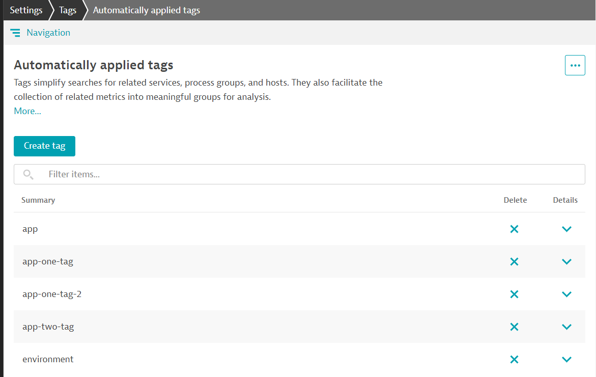
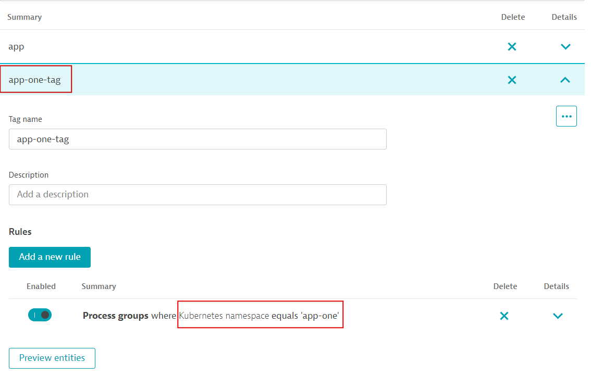
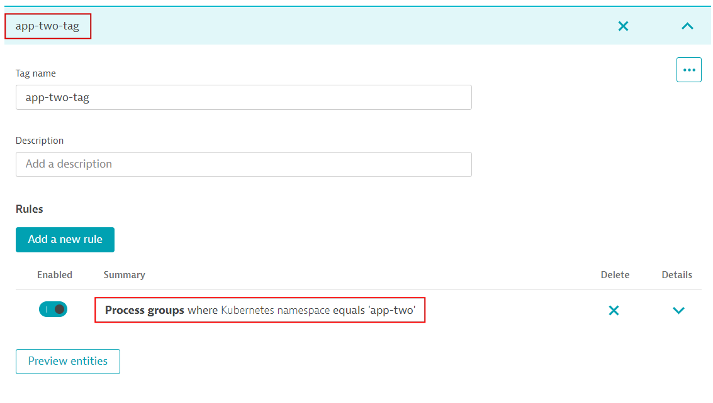

## Exercise 3: Configuration variables

Envision a scenario where you have similar application configurations in the same or a different Dynatrace environment. You want to configure these applications using the same JSON template uniformly. How can you handle a requirement where one of the settings (e.g., user session coverage percentage) must differ across instances of this template?

This exercise aims to introduce variables in our JSON templates to manage this requirement.

Please [download the exercise-3 sample zip file](https://github.com/dynatrace-ace/monaco-self-paced-exercises/releases/download/1.0.2/exercise-03-to-download.zip) and unzip it on your machine.

```bash
mkdir exercise-03
cd exercise-03
mv <DOWNLOADED-EXERCISE-FOLDER-PATH> .
```

### Step 1 - Explore configuration

#### Folder structure

1. After downloading the exercise files, explore the contents of the `exercise-03` folder. 

    ```text
    ├── apps
    │    ├── app-one
    │    │    ├── _config.yaml
    │    │    └── auto-tag.json
    │    ├── app-two
    │    │    └── _config.yaml
    │    └── shared
    │         ├── _config.yaml
    │         ├── application-detection-rule.json
    │         ├── application.json
    │         ├── csm.json
    │         ├── dashboard.json
    │         ├── k8s-auto-tag.json
    │         └── management-zone.json
    ├── infrastructure
    │    ├── _config.yaml
    │    ├── auto-tag.json
    │    └── request-attribute.json
    ├── manifest.yaml
    ```

The folder includes two Monaco projects:

A project "**infrastructure**" that contains generic configuration related to the underlying infrastructure:
- Auto tagging rules
- Request attributes

A project "**apps**" that contains configuration specific to apps app-one and app-two:
- Application definition
- Application detection rules
- Auto tagging rules
- Calculated services metrics
- Dashboards
- Management zones

#### Application configuration

2. Navigate to the application definitions stored in `apps/app-one/_config.yaml`

3. Take a closer look at the `# auto-tag` section

  ```yaml
  # auto-tag
  - id: tagging-app-one-type-api
    type:
      api: auto-tag    
    config:
      name: app-one-tag
      template: ../shared/k8s-auto-tag.json
      skip: false
  ```

  We can see that this section makes use of a template stored in `../shared/k8s-auto-tag.json`. This template is also referenced from `apps/app-two/_config.yaml`

### Step 2 - Introduce variables

In order to use variables in a Monaco configuration, we must replace hardcoded values in JSON objects with variables using the following format:

```text
{{ .VARIABLE_NAME }}
```

> **Note:** Although this format is based on the Golang template library and notations, only selecting a specific field is fully supported, i.e. dot followed by name of field.

In our example, we want to turn Kubernetes namespace, represented in the configuration template by the field `comparisonInfo`, in a variable called `value`.

1. To do so, open the configuration template we identified earlier `apps/shared/k8s-auto-tag.json`

2. Find the field `comparisonInfo` and notice that the `value` is hardcoded as `default`:

  ```json
  "rules": [
    {
      "type": "PROCESS_GROUP",
      "enabled": true,
      "valueFormat": null,
      "propagationTypes": ["PROCESS_GROUP_TO_SERVICE"],
      "conditions": [
        {
          "key": {
            "attribute": "PROCESS_GROUP_PREDEFINED_METADATA",
            "dynamicKey": "KUBERNETES_NAMESPACE",
            "type": "PROCESS_PREDEFINED_METADATA_KEY"
          },
          "comparisonInfo": {
            "type": "STRING",
            "operator": "EQUALS",
            "value": "default",
            "negate": false,
            "caseSensitive": true
          }
        }
      ]
    }
  ]
  ```

3. Turn the value of that field `default` into a variable:

    ```json
    "value": "{{ .namespace }}",
    ```
    >
    >The dot `.` in front of `namespace` is also required as it's part of the format.

4. Save the changes

### Step 3 - Reference value and assign a value

Now that we have defined a variable in the JSON template, we can assign values to it in the YAML file that contains the instances of the template to be created.

1. Open the `apps/app-one/_config.yaml` file, add the variable, and assign a value to it like shown in the snippet below:

  ```yaml
  # auto-tag
  - id: tagging-app-one-type-api
    type:
      api: auto-tag    
    config:
      name: app-one-tag
      template: ../shared/k8s-auto-tag.json
      parameters:
        namespace: app-one
      skip: false
  ```

  > **Note:** Parameters can be of different types with type `value` being the default. For `value` parameters, a short form syntax (e.g. `namespace: app-one`) can be used. Details on other supported types and examples can be found in the [docs](https://www.dynatrace.com/support/help/manage/configuration-as-code/configuration/yaml-configuration#parameters).

2. Save the changes

3. Repeat these steps but with `namespace: app-two` in `apps/app-two/_config.yaml`

### Step 4 - Deploy the configurations

1. Go back to the parent directory where the `manifest.yaml` resides. Open this file and explore the contents.

    ```yaml
    ---
    manifestVersion: "1.0"

    projects:
      - name: apps
        path: apps
        type: grouping
      - name: infrastructure
        path: infrastructure

    environmentGroups:
      - name: default
        environments:
          - name: development-environment
            url:
              type: environment
              value: DT_TENANT_URL
            auth:
              token:
                name: DT_API_TOKEN
    ```

2. Verify that the environment variable `DT_API_TOKEN` still exists

    ```bash
    echo $DT_API_TOKEN
    ```

    If not, recreate it from the token you created in the previous exercises.

    ```bash
    export DT_API_TOKEN=PASTE-YOUR-API-TOKEN-HERE
    ```
3. Verify that the environment variable `DT_TENANT_URL` still exists

    ```bash
    echo $DT_TENANT_URL
    ```

    If not, recreate it with your Dynatrace environment URL. Include `https://` but ensure there is no trailing `/` at the end of the URL.

    ```bash
    export DT_TENANT_URL=PASTE_YOUR_TENANT_URL_HERE
    ```

4. Take a closer look at the `apps/app-one/_config.yaml` and evaluate the following piece of the configuration parameters under  `# app-detection-rule`. `pattern` parameter is a type `compound` and it contains an `ingressDomain` parameter that has an environment variable `INGRESS_DOMAIN` .

      ```yaml
      parameters:
        pattern:
          type: compound
          format: "{{ .protocol }}://{{ .applicationSubdomain }}.{{ .ingressDomain }}"
          references:
            - protocol
            - applicationSubdomain
            - ingressDomain
        protocol: http
        applicationSubdomain: simplenodeservice-app-one
        ingressDomain:
          name: INGRESS_DOMAIN
          type: environment
      ```

  Create `INGRESS_DOMAIN` environment variable before executing the monaco deploy command. Otherwise, it will give an error message `environment variable INGRESS_DOMAIN not set`.

  ```bash
  export INGRESS_DOMAIN=self-paced.info
  ```

5. Run monaco deploy command first with dry-run option
    
  ```bash
  monaco deploy manifest.yaml --dry-run   
  ```
    
6. If there is no validation error, you can now run monaco without a dry-run option to apply the configurations on your Dynatrace environment

  ```bash
  monaco deploy manifest.yaml 
  ```
    
### Step 5 - View results in Dynatrace

1. As a last step, go to your Dynatrace environment and verify that Monaco updated the automatic tagging settings.
   It will create multiple auto-tagging configurations as follows when you navigate to `Settings` > `Tags` > `Automatically applied tags`:
   
    
    
    Additionally, it will update the two auto-tagging configurations (`app-one-tag`, `app-two-tag`) and will change the `namespace` from a fixed value to a parametrized value using Monaco.

    

    

### This concludes Exercise 3!
