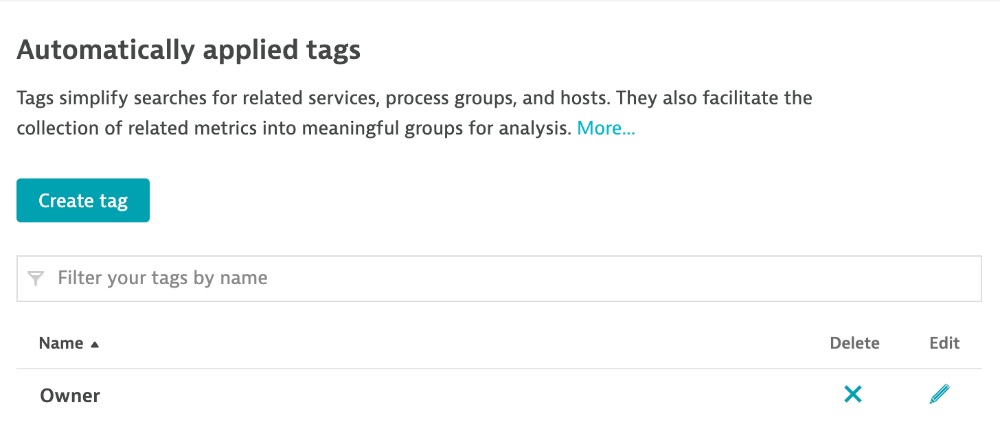

## Exercise 4: Delete and restore configuration
In this exercise, we'll use Monaco to delete a specific configuration. Upon deletion, we want to restore all configs from the backup created earlier.

Configurations which aren't needed anymore can also be deleted in an automated fashion. The `delete` command is a convenient way to remove one or more configurations from one or more Dynatrace environments. For example, Monaco can be used to clean up ephemeral configurations in development environments.

The `delete` command takes two arguments as YAML files. A manifest file which contains the list of Dynatrace environments and a delete file where configurations defined are to be removed.

If you don't specify file names, the command tries to find a `manifest.yaml` and a `delete.yaml` file in the current folder.

 ```bash
monaco delete -m <manifest.yaml> --file <delete.yaml> [flags]
```

The content of a delete.yaml is as follows:

```yaml
delete:
  - <api/name> OR <schema/config-id>
  - …
```

To delete configs, use <api>/<name> (for example, java-service/My Config Name)
To delete settings objects, use <schema/config-id> (for example, builtin:anomaly-detection.service/my-service-id)

Here's one example of `delete.yaml` with multiple configurations:

```yaml
delete:
  - "auto-tag/app-one"
  - "auto-tag/app-two"
  - "management-zone/app-one"
  - "calculated-metrics-service/simplenode.staging"
```

### Step 1 - Verify existence of target object

Since we'll be deleting the auto tagging rule created in exercise-1, let's make sure the tag still exists.

1. Open the Dynatrace web UI and navigate to `Manage` > `Settings`

2. Open `Tags` > `Automatically applied tags`

3. Confirm that tag `Owner` still exist

    

### Step 2 - Prepare the delete file

1. Create a new directory for this exercise and copy the contents of the **manifest.yaml** file from Exercise-3.
   Please make sure to locate the correct directory of exercise-3.
 
   ```bash
    mkdir exercise-04
    cd exercise-04
    cp ../exercise-03/manifest.yaml .
   ```

   But don´t worry, below is the content of the manifest.yaml file that you can copy and paste.
 
    ```yaml
    ---
    manifestVersion: "1.0"

    projects:
      - name: apps
        path: apps
        type: grouping
      - name: infrastructure
        path: infrastructure

    environmentGroups:
      - name: default
        environments:
          - name: development-environment
            url:
              type: environment
              value: DT_TENANT_URL
            auth:
              token:
                name: DT_API_TOKEN
   ```
 
2. Save the changes

3. Create a new file `delete.yaml` on the same directory to make it look like the snippet below.
    
    ```yaml
    delete:
      - "auto-tag/Owner"
    ```

4. Save the changes. Confirm that both `manifest.yaml` and `delete.yaml` exist in the current directory

### Step 3 - Run Monaco

1. Verify that the environment variable `DT_API_TOKEN` still exists

    ```bash
    echo $DT_API_TOKEN
    ```

    If not, recreate it from the token you created in the previous exercises.

    ```bash
    export DT_API_TOKEN=PASTE-YOUR-API-TOKEN-HERE
    ```

2. Verify that the environment variable `DT_TENANT_URL` still exists

    ```bash
    echo $DT_TENANT_URL
    ```

    If not, recreate it with your Dynatrace environment URL. Include `https://` but ensure there is no trailing `/` at the end of the URL.

    ```bash
    export DT_TENANT_URL=PASTE_YOUR_TENANT_URL_HERE
    ```

3. Run Monaco

    ```bash
    monaco delete -m manifest.yaml --file delete.yaml
    ```
    You can also use the below command simply as the manifest file name is already "manifest.yaml" and the delete file name is "delete.yaml".
    ```bash
    monaco delete
    ```

    Monaco should execute and you shouldn't see any errors

    ```text
    2022/12/21 01:28:41 INFO  Deleting configs for environment `development-environment`
    2022/12/21 01:28:41 INFO  Deleting configs of type auto-tag...
    ```

4. Confirm in your Dynatrace environment that the `Owner` tag doesn't exist anymore (refresh the page if it's already open)

### Step 4 - Restore configuration from backup

Now that we deleted configuration, we want to restore it from the backup we created earlier. In a real scenario this might not only be one configuration (e.g. auto-tag) but multiple configs across different projects and environments. The concept stays the same: If a configuraiton is backed up (= managed) by Monaco, Monaco can that very configuration.

In addition to a backup/restore use case, this workflow also comes in handy when you migrate between environments. Monaco doesn't care whether a configuration is deployed to the environment it was initially downloaded from, a completely separate environment or even multiple environments.

1. Navigate to and explore the directory of the backup we created earlier (exercise_02):

    Your directory should look similar to this:

    ```text
    │── manifest.yaml
    └── backup
        │── builtin:tags.auto-tagging
        │   │── config.yaml
        │   │── aaaaaaaa-bbbb-cccc-eeee-ffffffffffff.json
        │── ...
    ```

2. Verify your deployment with a dry run:

    ```bash
    monaco deploy manifest.yaml -d
    ```

3. And deploy your backup:

    ```bash
    monaco deploy manifest.yaml
    ```

4. Confirm in your Dynatrace environment that the `Owner` tag is restored (refresh the page if it's already open).

#### Congratulations on completing Exercise 4!
